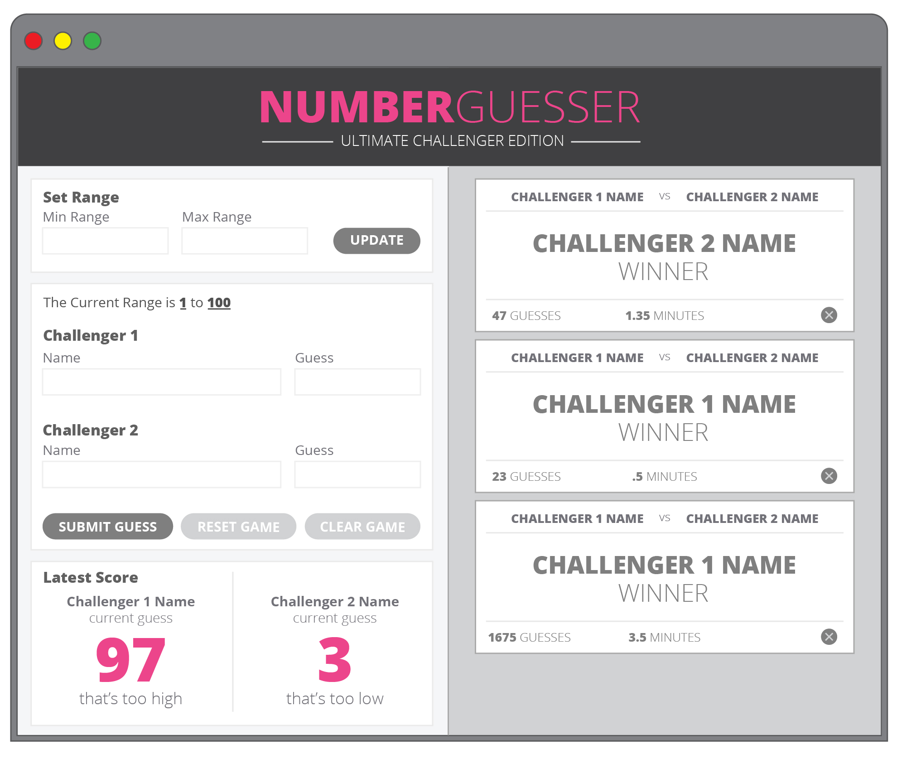
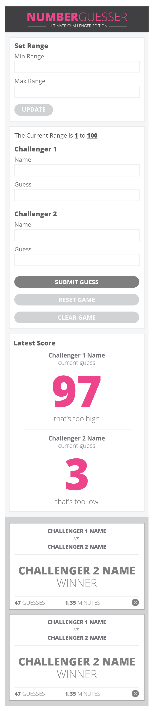
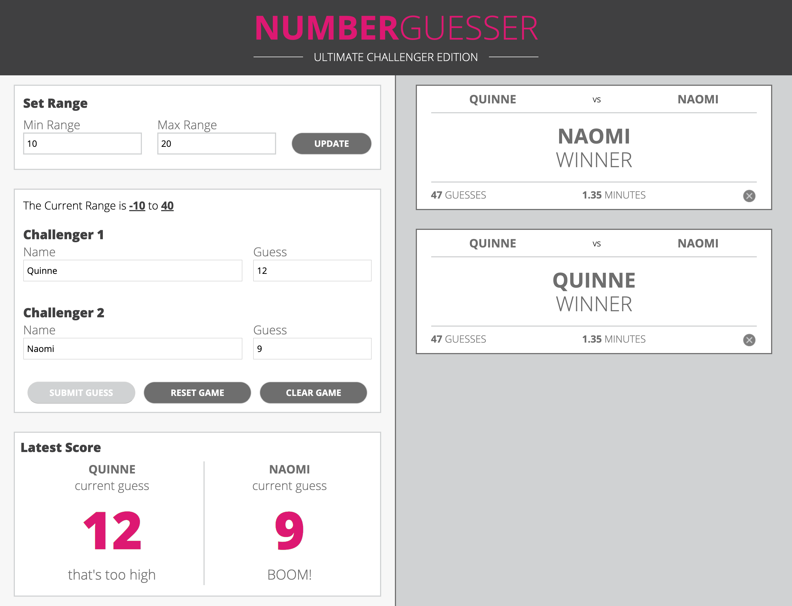
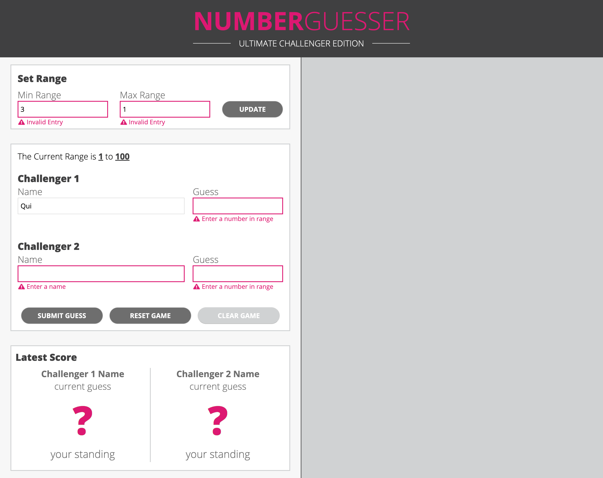
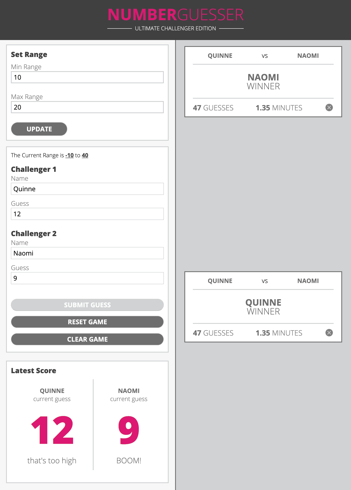
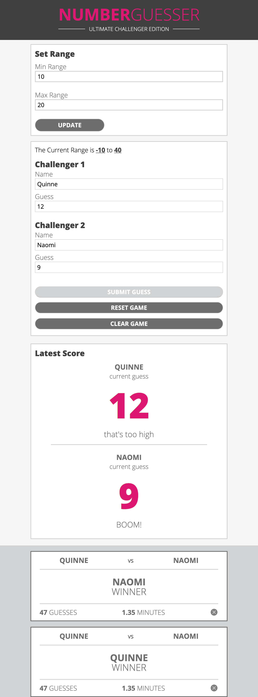
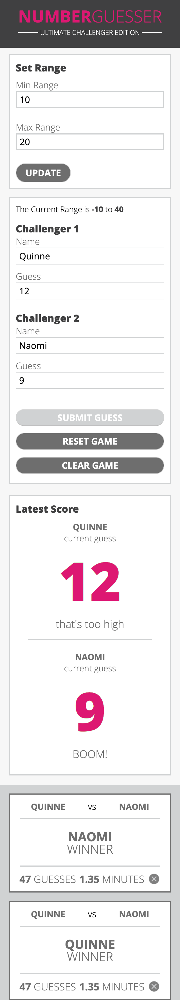

# Number Guesser

Below is the result of the Mod 1 1906 paired project at Turing School of Software and Design. Number Guesser is a web game in which the user tries to figure out which random number has been generated. If both guesses are wrong the guess display area will say whether the guess was too low or too high. If they guess correctly, the display area will show “BOOM!.” Upon correct guess, a card will pop up on the right side of the page, displaying both challenger names and the winner.  When a player wins, the range from which the user can chose a number increases by 20; 10 numbers lower than the previous minimum and 10 numbers higher than the previous maximum.  If any input boxes are left empty, error messages will display beneath the input box along with an error border. The error messages will also appear if a number is guessed outside of the specified range.

## Visuals

**Number Guesser Initial Static Comp Desktop:**

**Number Guesser Initial Static Comp Desktop with errors:**

**Number Guesser Initial Static Comp Mobile:**

**Number Guesser Final Static Comp Desktop:**

**Number Guesser Final Static Comp Desktop with errors:**

**Number Guesser Final Static Comp Media Query 1:**

**Number Guesser Final Static Comp Media Query 2:**

**Number Guesser Final Static Comp Mobile:**

## Contributions

Naomi Campos and Quinne Farenwald
